# ✈️ Transit & No-Show Passenger Analytics – Data Warehouse + Power BI Dashboard

## 📊 Overview
This project is a complete end-to-end Business Intelligence (BI) solution developed during my internship at Ethiopian Airlines. It focuses on analyzing transit and no-show passenger behavior using data from the airline's local SQL Server database. The objective was to extract, transform, and load data into a SQL-based data warehouse and deliver a Power BI dashboard that enables efficient, data-driven decision-making.

Key outcomes include the development of a robust ETL pipeline using SSIS, daily-scheduled data extraction, and an interactive Power BI report that visualizes KPIs across time periods, flight routes, booking classes, and passenger types.

## 🔧 Project Components

**Data Extraction:** Automated daily extraction from local SQL Server databases using SSIS

**Data Warehousing:** Staging and loading into a star-schema BI warehouse

**Data Transformation:** Cleaning, deduplication, lookup resolution, and data type conversion (e.g., NTEXT to NVARCHAR)

**Power BI Reporting:** Visual KPIs, interactive filtering, and DAX-based metrics

## ✅ ETL Pipeline Development (SSIS)

- Designed and implemented a star-schema Data Warehouse by integrating five operational tables (BookedPassengers, Passengers, Hotels, HotelBookings, NoShowPassengers)

- Resolved complex data type issues, including datetime2 precision mismatches and NTEXT to NVARCHAR conversions

- Built and automated data flow pipelines to load dimension and fact tables with referential integrity

- Applied advanced SSIS transformations such as Lookups, Sort, Conditional Splits, and Data Conversion for clean and consistent data flow

- Developed a robust DimDate logic to handle surrogate keys and null-safe joins in time-based reporting

## 📌 Key Performance Indicators (KPIs)
### Transit Passengers

- Total transit passengers (daily, weekly, monthly)

- Growth rate and average transit duration

- % by destination and contributing airlines

- Peak transit hours

- Hotel distribution among transit passengers

### No-Show Passengers

- Total no-shows by date and route

- No-show rate (vs. total bookings)

- Revenue loss estimation

- Breakdown by sector and booking class

### Interactive Filters

- Date range (custom/daily/weekly/monthly)

- Flight route

- Passenger type (transit or no-show)

- Booking class

- Peak hour selection

### 📊 Power BI Dashboard Screenshots
Interactive dashboards built with DAX for monitoring key airline KPIs:
#### 1. Overview

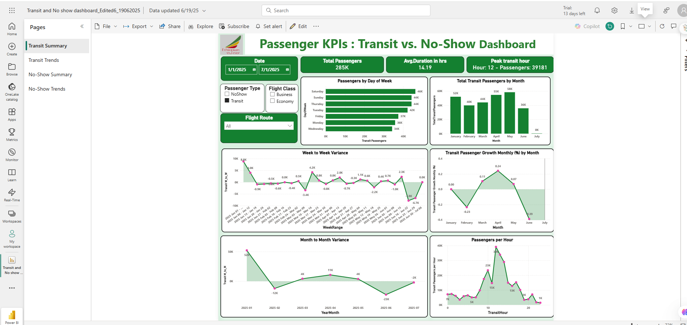

#### 2. Transit KPIs
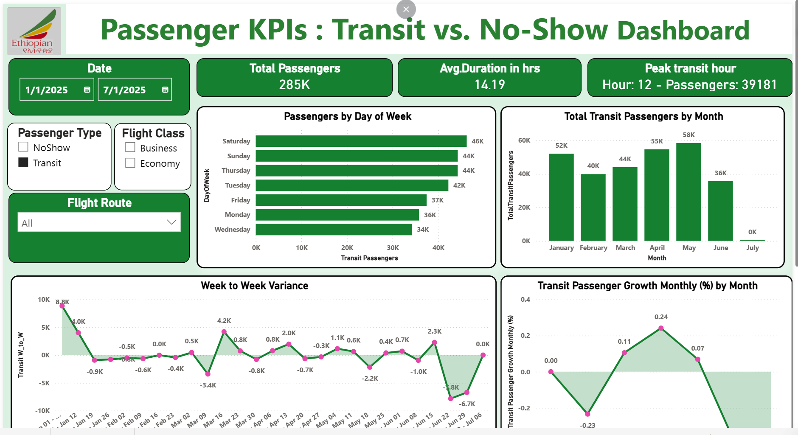

#### 3. No-Show KPIs
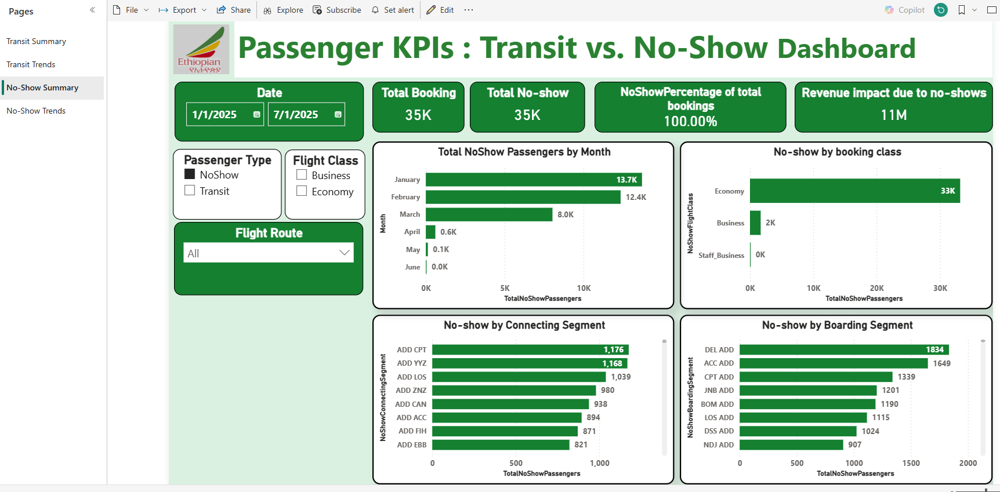

#### 4. Hotel Distribution
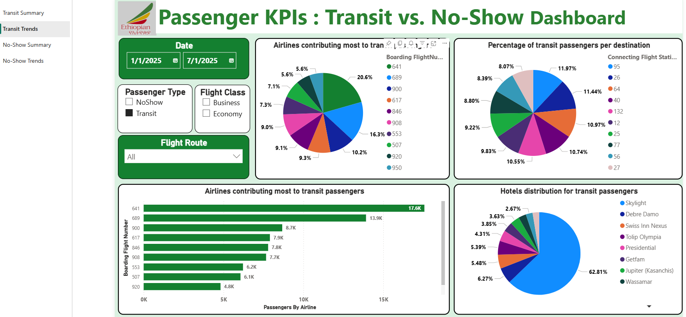

#### 5. Revenue Impact
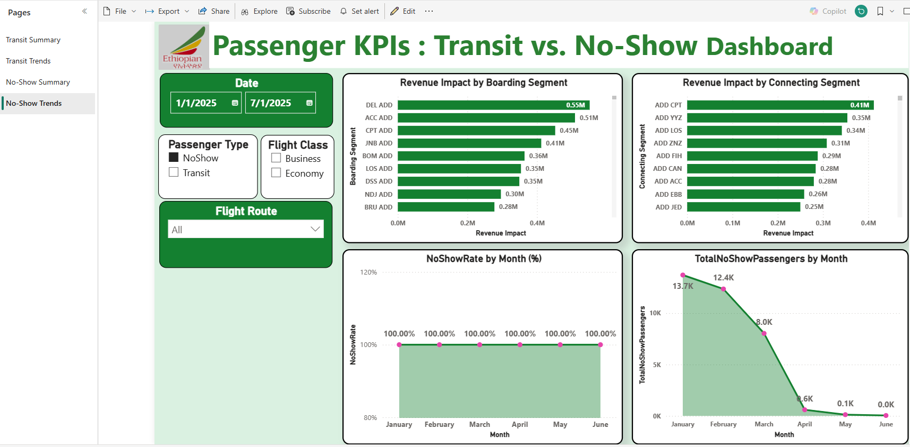

### 🔁 SSIS ETL Pipeline Screenshots

#### 1. Extracting from Source View
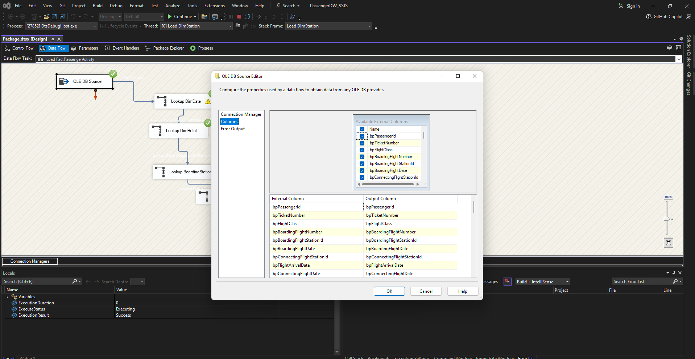

#### 2. Converting NTEXT to NVARCHAR
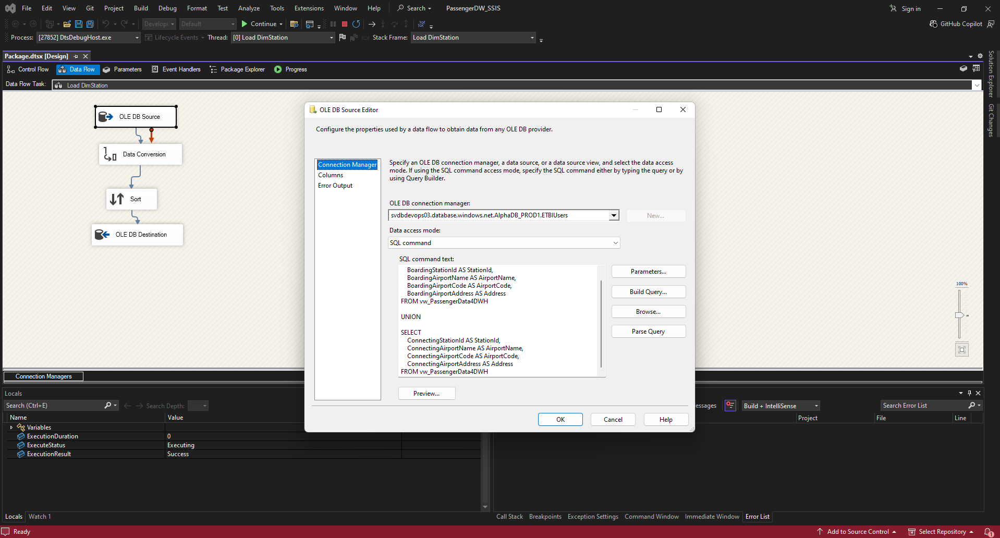

#### 3. Lookup: DimStation
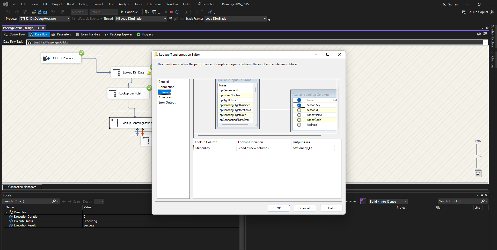

#### 4. Lookup: DimHotel
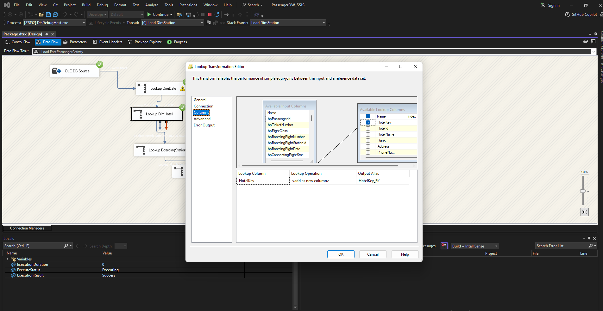

#### 5. Lookup: DimDate
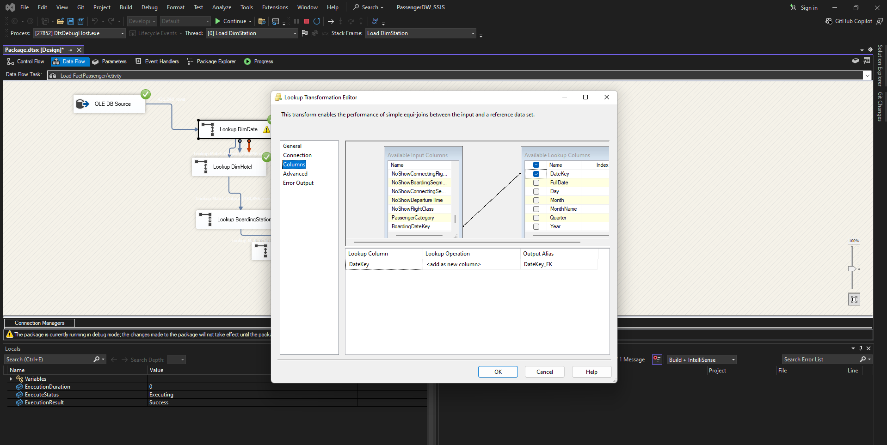

#### 6. Load Fact Table
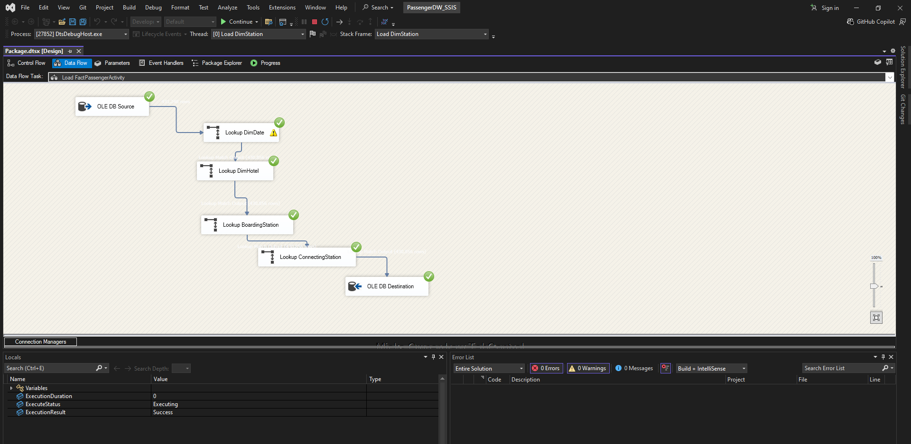

#### 7. Package Execution
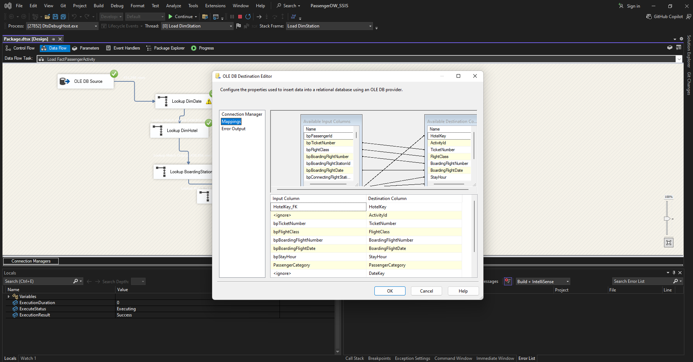

#### 8. Final ETL Pipeline Overview
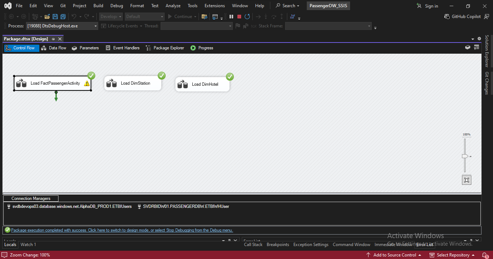

## Tech Stack
- SSIS (ETL Pipelines)
- SQL Server 2019
- Power BI (DAX, Measures, Visuals)
- SSMS (T-SQL Querying, Debugging)

## 💡 What I Learned

 **Real-world Data Warehousing:** Dimensional modeling, fact-dimension schema, ETL design, and troubleshooting (SSIS)

**Power BI:** Dashboard design using various visuals (bar charts, cards, maps, tables), slicers for interactivity, and storytelling through KPIs

**DAX:** Creating custom measures for business metrics like no-show rate, growth, revenue impact, and transit duration

 **SQL Server Management Studio (SSMS):** Writing and debugging complex SQL queries, creating and managing views, and accessing relational databases

**Data cleaning and preprocessing:** Resolving nulls, converting data types (e.g., NTEXT to NVARCHAR), and ensuring referential integrity

 **End-to-end BI workflow:** From data extraction and transformation to visualization and decision support

**Communication and collaboration:** Working with system admins to access and prepare operational data

**Presenting data findings:** Explaining insights clearly to non-technical stakeholders using visuals and business language

 **Stakeholder-focused report development:** Aligning dashboard design and KPIs with airline operations, hotel booking, and customer behavior

**Transferable business intelligence workflows:** Applicable across industries for reporting, analysis, and decision-making

  ## 🗃️ Data Warehouse Schema

- [FactPassengerActivity](./SQL/Create_FactPassengerActivity.sql)
- [DimHotel](./SQL/Create_DimHotel.sql)
- [DimStation](./SQL/Create_DimStation.sql)
- [DimDate](./SQL/Create_DimDate.sql)

