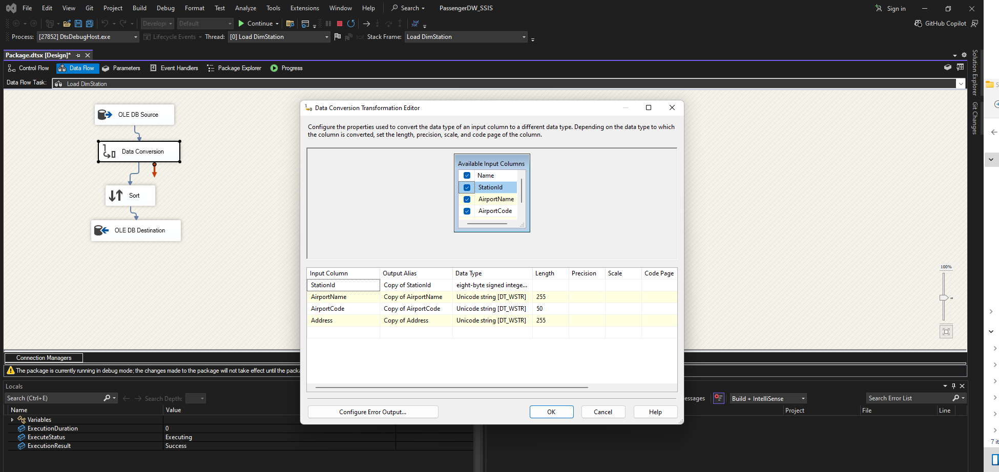

# ✈️ Transit & No-Show Passenger Analytics – Data Warehouse + Power BI Dashboard

## Overview
A complete end-to-end BI project built during my internship at Ethiopian Airlines and AHRI. The goal was to consolidate passenger data and build actionable KPIs to support airline business operations using SSIS, SQL Server, and Power BI.

## ETL Pipeline (SSIS)
- Designed a Data Warehouse by integrating 5 tables (BookedPassengers, Passengers, Hotels, HotelBookings, NoShowPassengers)
- Resolved complex data type conflicts, especially datetime2 and NTEXT conversions
- Built and automated loading for Dimension and Fact tables, including robust Date Lookup logic
- Applied advanced data flow handling using lookups, sort, and data conversion transformations

### 📊 Power BI Dashboard Screenshots

#### 1. Overview

#### 2. Transit KPIs

#### 3. No-Show KPIs

#### 4. Hotel Distribution

#### 5. Revenue Impact

Interactive dashboards built with DAX for monitoring key airline KPIs:

### 🧭 Transit Passenger KPIs:
- Transit passengers by day/week/month
- Growth rate and average transit duration
- Airlines contributing most to transit flow
- Hotel distribution and top destination breakdown

### ❌ No-Show Passenger KPIs:
- No-show trends by booking class, sector, and route
- No-show rate calculation
- Revenue loss estimation
- Daily/weekly/monthly analysis

### 🔍 Filtering Options
- Date range selector (calendar, custom range)
- Flight route
- Passenger type (Transit / No-show)
- Booking class
- Peak hours
- 
### 🔁 SSIS ETL Pipeline Screenshots

### 🔁 SSIS ETL Pipeline Screenshots

#### 1. Extracting from Source View

#### 2. Converting NTEXT to NVARCHAR

#### 3. Lookup: DimStation

#### 4. Lookup: DimHotel

#### 5. Lookup: DimDate

#### 6. Load Fact Table

#### 7. Package Execution

#### 8. Final ETL Pipeline Overview

## Tech Stack
- SSIS (ETL Pipelines)
- SQL Server 2019
- Power BI (DAX, Measures, Visuals)
- SSMS (T-SQL Querying, Debugging)

💡 What I Learned

**Real-world Data Warehousing: ** dimensional modeling, fact-dimension schema, ETL design, and troubleshooting (SSIS)

Power BI: dashboard design using various visuals (bar charts, cards, maps, tables), slicers for interactivity, and storytelling through KPIs

DAX: creating custom measures for business metrics like no-show rate, growth, revenue impact, and transit duration

SQL Server Management Studio (SSMS): writing and debugging complex SQL queries, creating and managing views, and accessing relational databases

Data cleaning and preprocessing: resolving nulls, converting data types (e.g., NTEXT to NVARCHAR), and ensuring referential integrity

End-to-end BI workflow: from data extraction and transformation to visualization and decision support

Communication and collaboration: working with system admins to access and prepare operational data

Presenting data findings: explaining insights clearly to non-technical stakeholders using visuals and business language

Stakeholder-focused report development: aligning dashboard design and KPIs with airline operations, hotel booking, and customer behavior

Transferable business intelligence workflows: applicable across industries for reporting, analysis, and decision-making

  ### 🗃️ Data Warehouse Schema

- [FactPassengerActivity](./SQL/Create_FactPassengerActivity.sql)
- [DimHotel](./SQL/Create_DimHotel.sql)
- [DimStation](./SQL/Create_DimStation.sql)
- [DimDate](./SQL/Create_DimDate.sql)

